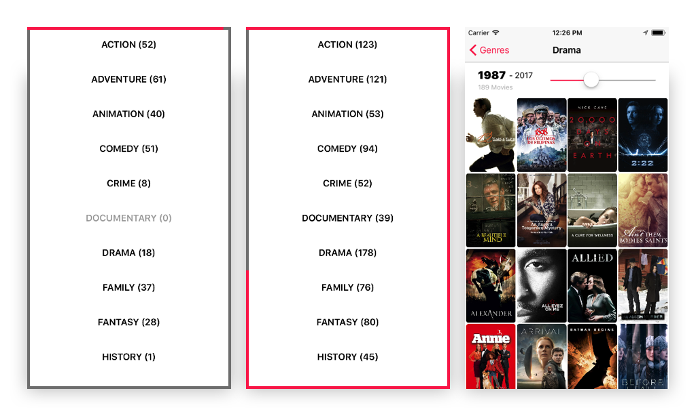

# Reactive X Networking App

Exploring and learning more about the world of reactive programming using RxSwift, RxCocoa and the TMDB movies API. More features will be added gradually.

#### Install
In a terminal window, cd into the root folder and run `$pod install` to install
`ContourProgressView` [(a progress extension I've built)](https://github.com/Bajocode/ContourProgressView), `RxSwift`, `RxCocoa` and `KingFisher`.

#### GenresViewController
The request is built using a `RxCocoa` `URLRequest` extension and is composed as follows:
1.  First the list of all available genres is fetched
2.  For each genre, the first 2 pages of movies are fetched and merged into 1 Observable
3.  After each movie batch arrives, it is added to the genre's `.movies` variable, while being alphabetically ordered by name.
4.  A custom `rx` extension is created for `ContourProgressView`, making it adhere to `UIBindingObserver` and bindable / drivable with data.

#### MoviesViewController
A slider (`.rx extension`) is bound to the minimum year of the movie release, which acts as a filter.
